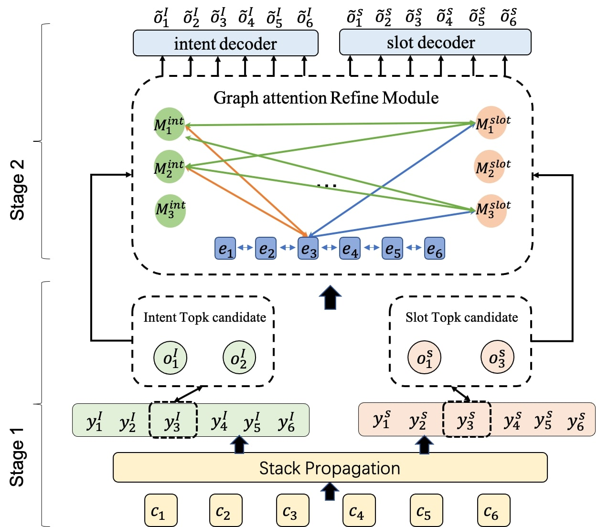

# **GAIR**: A **G**raph **A**ttention **I**nteractive **R**efine framework with contextual regularization for jointing intent detection and slot filling

Our code is based on [StackPropagation]([StackPropagation-SLU](https://github.com/LeePleased/StackPropagation-SLU)). Besides, we use StackPropagation Model as the stage one model, and refine the result by the graph attention interactive refine framework with contextual regularization. 

In the following, we will guide you how to use this repository step by step.

## Architecture

## Preparation

Our code is based on PyTorch 1.1 and runnable for both windows and ubuntu server. Required python packages:
    
> + numpy==1.21.5
> + tqdm==4.32.2
> + scipy==1.2.1
> + torch==1.8.1
> + ordered-set==4.0.2
> + transformers == 4.15.0
> + fastnlp==0.7.0

We highly suggest you using [Anaconda](https://www.anaconda.com) to manage your python environment.

## How to Train it

The script **train.py** acts as a main function to the project. For reproducing the results reported in our
paper, We suggest you the following hyper-parameter setting for CAIS dataset:

        python train.py -wed 64 -ehd 256 -aod 128 -dd=data/cais/  --topk 5 -bs 16

Similarly, for SMP dataset, you can also consider the following command: 

        python train.py -wed 256 -ehd 256 -aod 128  -dd=data/smp/ --topk 3  -bs 16

## How to Test it
To test model on CAIS or SMP dataset:
        python train.py  -dd=data/smp_or_cais/ --mode test -sd=model_save_path  --topk 3  
